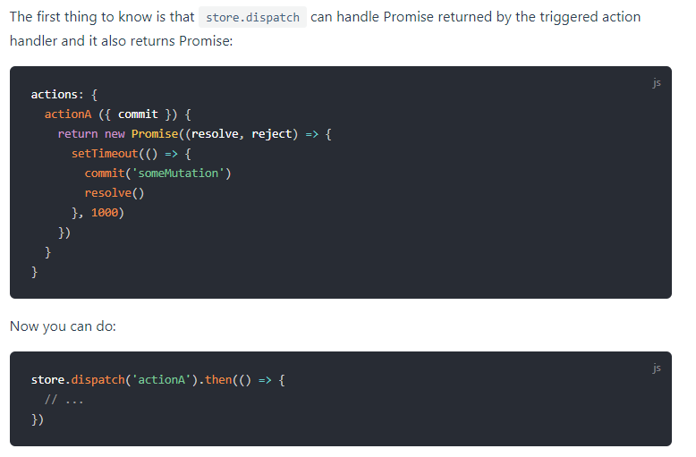

#一. 首页，登录和注册页

1. 配置less
2. element-ui 自行选择配置， 为啥export default ()=>{Vue.use(ElementUI)}也行
3. nuxt中a标签保持样式  .nuxt-link-exact-active
4. 回车<br>
5. 搜索框的选择，input的placeholder跟着改变
6. 梯形：
   transform-origin: bottom left;
   transform: scale(1.1,1.3) perspective(0.7em) rotateX(2.2deg);
7. element-UI的form验证自定义规则，写在data里面，return之    前， 并且定义的函数只能用箭头函数，否则this不对
   用箭头的时候this只想xue实例， 用function的时候this指向一个对象：


    

8. 解构赋值： 

   ```js
   let { password2, ...data } = this.registerForm
   ```

     获得registerForm中除了password2以外的数据，存于data对象中


 9. 服务器返回400，很可能是数据格式出现问题，要么是data，要么是header（content-type）

    nuxt.js中的axios用法：

    ```js
    this.$axios.post('/accounts/register', data)
    ```

    其中data为数据对象

    


10. 因为是服务器端渲染，无法直接使用localStorage进行本地存储

    可以通this.$store中的vuex的actions,其中值得注意的是：

    

    而vuex中的actions表明：

    

    [Promise相关知识]( https://developer.mozilla.org/en-US/docs/Web/JavaScript/Reference/Global_Objects/Promise )

    =============================================

    如果在组件内部已经使用axios的promise，可以不用actions, 而使用mutations和commit来实现本地存储

    问题就是要知道，store可以与客户端进行联系


11. header怎么知道现在是login还是没有login？通过store里面存储的信息，以及本地存储的信息     来判断，当需要复杂的组件件数据的  传递时，应立刻想到用vuex（store)


#二. 国内机票页

 1. 令img变为块级元素可以去除下方的margin

    ```css
    img{
        display: block;
    }
    ```

2. 数据交换
   ```js
   let a = 1
   let b = 2
   [a, b] = [b, a]
   ```

#三. 机票列表页(/domestic-air-tickets/flights/?...)

1. 组件中的props中如果要较大的对象数据, 在DOM中如果使用该prop里面的数据，会报错说undefined，解决方法：使用watch进行监听
    ```js
    watch: {
        flight: {
        handler (newVal, oldVal) {
            if (newVal) { this.hasCreated = true }
        },
        deep: true
        }
    }
    ```
    输出newVal和oldVal会发现，watch只触发了一次，其中oldVal为undefined，newVal为完整的对象，那么只需要监听到flight不是undefined即可进行渲染

2. 两个Date的实例对象可以直接相减，获得两个时间间隔的毫秒数。运算符重载的实现方法：
    ```js
    function Test(){
        let _this = this
        this.num = 0
        this.setNumber = n => { _this.num = n }
        this.toString = () => _this.num
        //this.valueOf = () => _this.num
    }
    let a = new Test()
    a.setNumber(2)
    let b = new Test()
    b.setNUmber(3)
    //结果a+b=5
    ```
    利用了Object里面的prototype: toString或着valueOf和运算符的隐式转换，令对象在隐式转换的时候返回特定的值。
    MDN对valueOf()的解释：
    >"JavaScript calls the valueOf method to convert an object to a primitive value."

3. ```html
    <el-select v-on:click="option=$event.target.placeholdler">
    ```
    通过$event可以在html的标签里面获得时间的参数：event

4. pagenation(from element-ui)
   .sync modifier: vue.js中v-bind的modifier, 作用类似与v-model，令数据进行双向绑定，但是v-model只针对input的value属性，而.sync可以用于任意属性的双向绑定

5. 带query的编程式路由：
    ```js
    this.$router.push({
        path: '/domestic-air-tickets/flights',
        query: params
    })
    ```

6. 数组去重：
    1. 简单类型的去重：用Set
    ```js
    let exDupArr = [ ...new Set(dupArr) ]
    ```
    2. 复杂类型数组去重：Array.prototype.reduce()，还有一个hash对象，用于筛选不重复的对象
    ```js
    let historySet = []
    const hash = {}
    if (historyList.length > 0) {
    historySet = historyList.reduce((acc, cur) => {
        const hashKey = cur.departCity + cur.destCity + cur.departDate
        if (!hash[hashKey]) {
        hash[hashKey] = true
        acc.push(cur)
        }
        return acc
    }, [])
    }
    ```

7. 路由的path不变，query改变，如何实现组件的刷新？：
    1. 在跟组件中的<router-view>标签增加v-if
    ```html
    <router-view v-if="isRouterAlive" to="..." />
    ```
    2. 若为根组件，在methods中定义一个reload方法：
    ```js
    export default {
        data () {
            return {
                isRouterAlive = true
            }
        },
        methods: {
            reload () {
                this.isRouterAlive = false
                this.$nextTick(()=>{ this.isRouterAlive = true })
            }
        },
        // 如果不是根组件，则需要用到provide/inject对来进行传递
        provide () {
            return {
                reload: this.reload
            }
        }
    }
    ```
    在需要刷新的子组件中，使用方法：
    ```js
    // 如果为router-view为根组件：
    this.$root.reload()
    // 否则需要inject
    export default {
        inject: ['reload']
        ...
            this.reload()
        ...
    }
    ```
#四. 机票选择页(/domestic-air-tickets/order?...)

1. less中样式：
    ```less
    div{
        &.duration{
            font-size: 12px;
            color: #999999;
        }
    }
    //等价于
    div.duration{
        font-size: 12px;
        color: #999999;
    }
    ```
2. 令高度div的高度不跟随父级块的高度，而是适应内容高度
    ```css
    div{
        height: fit-content;
    }
    ```

#五. 酒店列表页面(/hotel)

1. element-ui里面的select深坑, label属性和表现内的text可以不同，不同之后的会出现的现象：下拉菜单里面没有"成人"二字，但是选择以后的input内有"成人"儿子
    ```html
    <el-select v-model="adultNum" size="mini" @change="selectAdult">
        <el-option
            v-for="adult in adultList"
            :key="adult"
            :label="adult+'成人'"
            :value="adult+'成人'"
        >
            {{ adult }}
        </el-option>
    </el-select>
    ```
2. input的readonly属性

3. 人数选择组件，如何令其隐藏？

4. 文本的伸缩：
    ```css
    p.hide{
        overflow: hidden;
        height: 24px; /*固定值*/
    }
    p.show{
        overflow: visible;
        height: fit-content;
    }
    ```

5. 地图模块，在因为有一个全局的AMap对象，eslint会报错，需要在.eslintrc.js文件中进行配置
    ```js
    globals: {
        AMap: false
    }
    ```

6. 使用第三方组件时，如果在CSS中不方便调内部样式,可以用行内样式调内容的样式，来撑大外部组件的大小：
    ```html
    <el-dropdown-item>
    <i class="iconfont iconcircle" />
    <span style="display:inline-block;width:100px">1星</span>
    </el-dropdown-item>
    ```
7. 设置滚动条：
    ```CSS
    ul{
        height: 250px;
        overflow: auto;
    }
    ```
